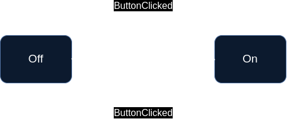

# hc-FSM

[](https://opensource.org/licenses/MIT)
[](https://github.com/madamskip1/hc-FSM/actions/workflows/build_and_test.yaml)

##### Compiler build support
[](https://github.com/madamskip1/hc-FSM/actions/workflows/build_g++.yaml)
[](https://github.com/madamskip1/hc-FSM/actions/workflows/build_clang++.yaml)
[](https://github.com/madamskip1/hc-FSM/actions/workflows/build_msvc.yaml)

**hcFSM** library rocks for building Finite State Machines (FSM) in C++, even hierarchical ones. It's all about simplicity and efficiency, letting you organize states easily and compile quickly. With its cool C++ template magic, runtime slowdowns are a thing of the past. Whether you're into embedded systems, gaming, or just coding for fun, this library has your back for smooth state-based behavior.

## Features

|Feature| Status | Added in |
|-|:-:|:-:|
|  Basic transition | ✔  | |
|  Automatic transition | ✔  | |
|  Hierarchical SM (substates) | ✔  | |
|  onEntry/onExit action | ✔  | |
|  Transition action | ✔  | |
|  Transition Guard | ✔  | |
|  Set initial state | ✔  | |

## Documentation

Detailed documentation can be found on [Wiki page](../../wiki/).


## Example

### Simple usage example

Provided example illustrates implementation for simple light control system (or whatever what can be on and off). The system involves a light with two states: `Off` and `On`. The transition between them (toggle) is triggered by a `ButtonClicked` event.

<p align="center">
    
</p>

```c++
struct On {};
struct Off {};
struct ButtonClicked {};

using transitions_table = hcFSM::TransitionsTable<
	hcFSM::Transition<Off, ButtonClicked, On>,
	hcFSM::Transition<On, ButtonClicked, Off>
>;

int main()
{
	auto light = hcFSM::StateMachine<transitions_table> {};
	// initial state is Off

	light.handleEvent<ButtonClicked>(); // transit to On
	light.handleEvent(ButtonClicked{}); // transit to Off
	auto buttonClickedEvent = ButtonClicked{};
	light.handleEvent(buttonClickedEvent); // transit to On

	return 0;
}
```

### More complex examples

More complex usage examples can be found in [examples dir](https://github.com/madamskip1/hc-FSM/tree/main/examples/):
- NPC AI -
- Elevator

## Integration/Installation

[](https://github.com/madamskip1/hc-FSM/releases)

The hc-FSM library provides at least two convenient methods for integration.
First, single header can be directly included in a project.
Alternatively, for an more organized approach or when dealing with larger projects, the library can be effortlessly integrated using CMake's FetchContent. This allows for easy incorporation into the build process with automatic downloading hc-FSM library.

### Single header
1. Download single header ([single_header/hcFSM.h](/single_header/hcFSM.h)) and put into a project
2. Include it as any other headers
```c++
 #include <{path}/hcFSM.h>
or
 #include "{path}/hcFSM.h>
```

### CMake's FetchContent
This method automatically download hc-FSM library during CMake's configuration and add it to given project. To use [FetchContent](https://cmake.org/cmake/help/latest/module/FetchContent.html), CMake >= 3.11 is required.

```cmake
include(FetchContent)

# Download hc-FSM
FetchContent_Declare(
    hcFSM
    GIT_REPOSITORY https://https://github.com/madamskip1/hc-FSM.git
    GIT_TAG v1.0.0
)
FetchContent_MakeAvailable(hc_fsm)

# link hc-FSM to target/project
target_link_libraries(target_project_name PRIVATE hcFSM)
```
